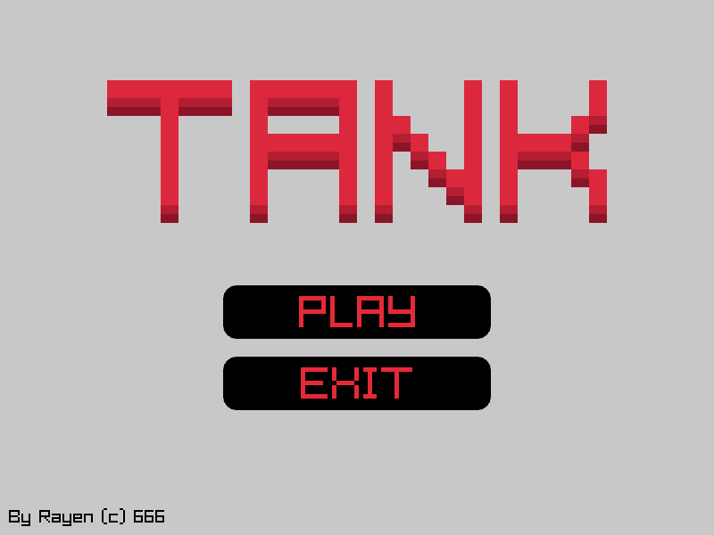
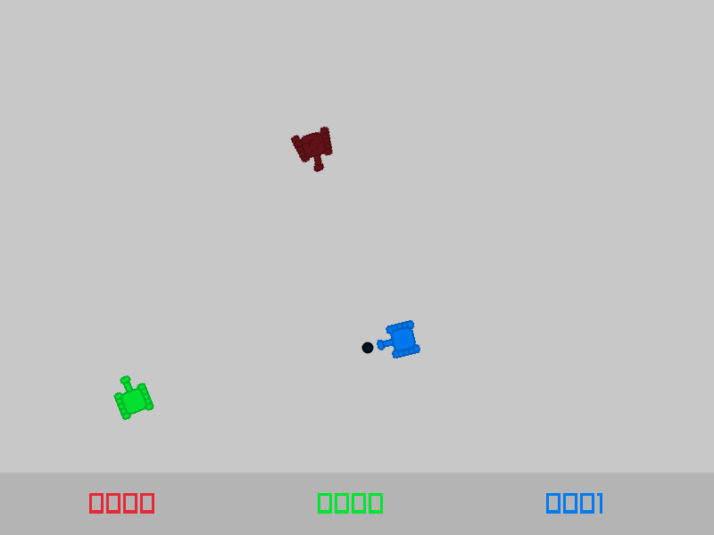

# TANK GAME
coded in pure C (C99)

### Screenshots




#### How To Compile It ?

first you have to download [raylib](https://github.com/raysan5/raylib/releases/tag/5.0)

#### clang:

```clang main.c -std=c99 -Ofast -flto -fshort-enums -ffast-math -funroll-loops -fno-trapping-math -fvectorize -lm -lraylib -s -o tankgame```

#### gcc:

```gcc main.c -std=c99 -Ofast -flto -fshort-enums -ffast-math -funroll-loops -fno-trapping-math -lm -lraylib -s -o tankgame```

### INFO:

the **tank** file in this rep is ELF64 (for linux)

all resources (images) are embeded in the .c file
